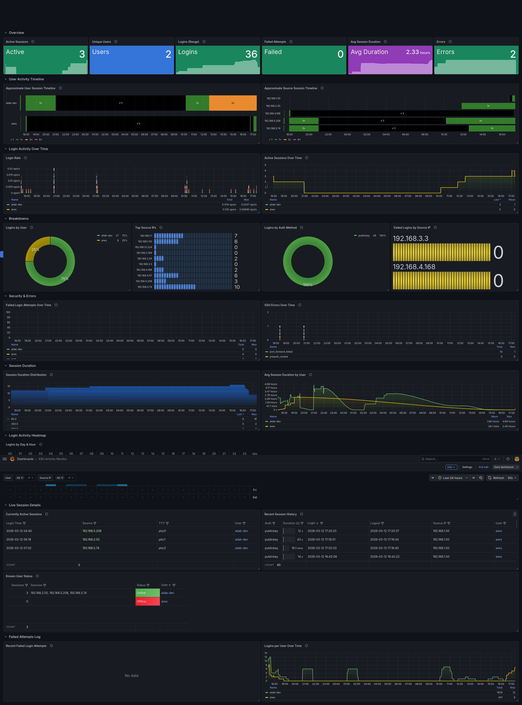

# SSH Stats Exporter

`ssh-stats` is a Linux SSH observability exporter. It backfills rotated auth logs, tails the live log safely across restarts and rotations, derives current remote sessions from `who`, and exposes both Prometheus metrics and JSON endpoints for the bundled Grafana dashboard.

## What You Get

- SSH login, logout, failure, and invalid-user metrics
- Session history, active-session, and user-status JSON endpoints
- A bundled Grafana dashboard in `contrib/grafana-dashboard.json`
- A systemd unit and environment file example in `contrib/` for release installs
- Safer public defaults: loopback bind, no wildcard CORS, and bounded metric labels

## Dashboard



## Security Model

The default configuration is intentionally conservative:

- The HTTP server listens on `127.0.0.1:9122`, not on all interfaces.
- The JSON API is enabled, but no CORS headers are sent unless you configure an allowlist.
- Prometheus metric labels default to `bounded` mode so brute-force traffic cannot create unbounded per-user and per-IP series growth.
- `/metrics` and the JSON endpoints serve cached runtime state instead of running `who` on every request.

If you need remote access:

- Change `SSH_STATS_LISTEN_ADDRESS` to a host-reachable address.
- Put the exporter behind a firewall or reverse proxy.
- Only set `SSH_STATS_CORS_ALLOW_ORIGINS` if a browser must call the JSON API directly.
- Set `SSH_STATS_DISABLE_JSON_API=true` if you only need Prometheus scraping.
- Set `SSH_STATS_METRICS_LABEL_MODE=full` only if you explicitly want uncapped per-user and per-source metric labels.

## Compatibility

| Distribution family | Default SSH log file | Service environment file |
|---|---|---|
| Debian / Ubuntu | `/var/log/auth.log` | `/etc/default/ssh-stats` |
| RHEL / Rocky / Alma / CentOS | `/var/log/secure` | `/etc/sysconfig/ssh-stats` |

The bundled systemd unit runs as `root` by default because many distros restrict SSH auth logs to root-only access. If your host exposes the logs to a dedicated service account, override `User=` and `Group=` in a systemd drop-in.

## Release Install

Download the latest release bundle for your architecture from this repository's GitHub Releases page. Each release includes:

- `ssh-stats` binary
- `ssh_stats.service`
- `ssh_stats.env.example`
- `grafana-dashboard.json`
- `SHA256SUMS.txt`

Install the binary and systemd assets:

```bash
sudo install -m 0755 ssh-stats /usr/local/bin/ssh-stats
sudo install -m 0644 ssh_stats.service /etc/systemd/system/ssh_stats.service
sudo install -m 0644 ssh_stats.env.example /etc/default/ssh-stats
sudo editor /etc/default/ssh-stats
sudo systemctl daemon-reload
sudo systemctl enable --now ssh_stats
```

On RHEL-family systems, copy the environment file to `/etc/sysconfig/ssh-stats` instead and set:

```bash
SSH_STATS_LOG_FILE=secure
```

Verify the service:

```bash
systemctl status ssh_stats --no-pager
curl http://127.0.0.1:9122/health
curl http://127.0.0.1:9122/metrics
curl http://127.0.0.1:9122/api/summary
```

`/health` reports `ok` only when log access, live tailing, and active-session refresh checks are healthy.

## Prometheus Setup

Add the exporter to `prometheus.yml`:

```yaml
scrape_configs:
  - job_name: ssh_stats
    static_configs:
      - targets: ["127.0.0.1:9122"]
    scrape_interval: 15s
```

If Prometheus runs on a different host, bind `ssh-stats` to a reachable address and update firewall rules accordingly.

Useful PromQL snippets:

```promql
sum(ssh_active_sessions)
```

```promql
sum(increase(ssh_failed_logins_total[1h]))
```

```promql
sum by (user) (rate(ssh_session_duration_seconds_sum[1h]))
/
sum by (user) (rate(ssh_session_duration_seconds_count[1h]))
```

## Grafana Setup

The dashboard in `contrib/grafana-dashboard.json` expects two datasources:

1. A Prometheus datasource for time-series panels
2. The [Infinity datasource plugin](https://grafana.com/grafana/plugins/yesoreyeram-infinity-datasource/) for JSON table panels

Recommended Grafana versions:

- Grafana 10.x or newer
- Infinity 2.x or newer

Configure the Infinity datasource with the exporter base URL that Grafana can actually reach:

- If Grafana runs on the same host as the exporter, use `http://127.0.0.1:9122`
- If Grafana runs in Docker, `localhost` means the container, not the host
- If Grafana is remote, use the exporter host IP or DNS name and make sure network policy allows access

The dashboard reads these JSON endpoints through Infinity:

- `/api/sessions/active`
- `/api/sessions/history?from=${__from:date:iso}&to=${__to:date:iso}&limit=200`
- `/api/users/status`
- `/api/failed?from=${__from:date:iso}&to=${__to:date:iso}&limit=500`
- `/api/heatmap?from=${__from:date:iso}&to=${__to:date:iso}`

Import flow:

1. Create the Prometheus datasource
2. Install and configure the Infinity datasource
3. Import `contrib/grafana-dashboard.json`
4. Map `DS_PROMETHEUS` to your Prometheus datasource
5. Map `DS_INFINITY` to the Infinity datasource that points at `ssh-stats`

If you disable the JSON API, the bundled dashboard's table panels will stop working.

## Configuration

All runtime options can be set with CLI flags or environment variables.

| Flag | Env Var | Default | Description |
|---|---|---|---|
| `--listen-address` | `SSH_STATS_LISTEN_ADDRESS` | `127.0.0.1` | HTTP listen address |
| `--port` | `SSH_STATS_PORT` | `9122` | HTTP listen port |
| `--log-dir` | `SSH_STATS_LOG_DIR` | `/var/log` | Directory containing SSH auth logs |
| `--log-file` | `SSH_STATS_LOG_FILE` | `auth.log` | Current SSH auth log filename |
| `--log-level` | `SSH_STATS_LOG_LEVEL` | `INFO` | Log verbosity |
| `--poll-interval` | `SSH_STATS_POLL_INTERVAL` | `1.0` | Seconds between tail polls |
| `--refresh-interval` | `SSH_STATS_REFRESH_INTERVAL` | `30.0` | Seconds between `who` refreshes |
| `--max-history` | `SSH_STATS_MAX_HISTORY` | `5000` | Maximum in-memory history retained |
| `--metrics-label-mode` | `SSH_STATS_METRICS_LABEL_MODE` | `bounded` | `bounded` caps metric-cardinality growth; `full` preserves every label |
| `--metrics-max-users` | `SSH_STATS_METRICS_MAX_USERS` | `200` | Max distinct metric `user` labels in bounded mode |
| `--metrics-max-source-ips` | `SSH_STATS_METRICS_MAX_SOURCE_IPS` | `500` | Max distinct metric `source_ip` labels in bounded mode |
| `--metrics-max-auth-methods` | `SSH_STATS_METRICS_MAX_AUTH_METHODS` | `32` | Max distinct metric `auth_method` labels in bounded mode |
| `--disable-json-api` | `SSH_STATS_DISABLE_JSON_API` | disabled | Disable `/api/*` endpoints |
| `--cors-allow-origin` | `SSH_STATS_CORS_ALLOW_ORIGINS` | none | Browser origins allowed to read JSON API responses |

Show the built-in CLI help:

```bash
ssh-stats --help
```

## HTTP Endpoints

| Endpoint | Description |
|---|---|
| `GET /metrics` | Prometheus scrape endpoint |
| `GET /health` | Health payload with log, tailing, and `who` refresh checks |
| `GET /api/sessions/active` | Current remote SSH sessions from the cached `who` snapshot |
| `GET /api/sessions/history` | Completed session history |
| `GET /api/failed` | Failed login history |
| `GET /api/summary` | Aggregate totals, unique users, top IPs, average duration, and active sessions |
| `GET /api/heatmap` | Login heatmap rows for Grafana table panels |
| `GET /api/users/status` | Known users with online/offline status, live session count, and sources |

Supported query parameters:

- `/api/sessions/history`: `limit`, `from`, `to`
- `/api/failed`: `limit`, `from`, `to`
- `/api/heatmap`: `from`, `to`

Notes:

- `from` and `to` accept ISO-8601 timestamps such as `2026-03-11T00:00:00Z`
- `limit` defaults to `200` and is capped by the configured history buffer
- Failed-attempt rows always include `timestamp`, `user`, `source_ip`, `port`, and `type`

## Exported Metrics

| Metric | Type | Labels | Description |
|---|---|---|---|
| `ssh_logins_total` | Counter | `user`, `source_ip`, `auth_method` | Successful SSH logins |
| `ssh_logouts_total` | Counter | `user` | Closed SSH sessions |
| `ssh_failed_logins_total` | Counter | `user`, `source_ip` | Failed authentication attempts |
| `ssh_invalid_user_attempts_total` | Counter | `user`, `source_ip` | Invalid username attempts |
| `ssh_active_sessions` | Gauge | `user`, `source_ip` | Current active remote SSH sessions |
| `ssh_unique_users_total` | Gauge | none | Distinct users seen in parsed logs |
| `ssh_session_duration_seconds` | Histogram | `user` | Session duration buckets |
| `ssh_errors_total` | Counter | `error_type` | SSH error counters |
| `ssh_preauth_connection_closed_total` | Counter | `source_ip` | Pre-authentication disconnects |
| `ssh_login_heatmap` | Gauge | `day_of_week`, `hour` | Login count by weekday and hour |
| `ssh_user_online` | Gauge | `user` | User online state from the latest `who` refresh |

In `bounded` mode, once the configured label caps are reached, new values are folded into the `__other__` bucket. This keeps metrics usable on noisy internet-facing SSH hosts without unbounded series growth.

## How It Works

1. Startup parses rotated logs first and then the current log, keeping a checkpoint so new lines written during startup are not skipped.
2. The tailer watches the live log for appended lines and inode changes caused by rotation.
3. The parser correlates `Accepted`, `session opened`, and `session closed` events by `sshd` PID.
4. Active sessions and online-user gauges come from periodic `who` refreshes rather than log-derived guesses.
5. JSON APIs and Prometheus metrics read from the in-memory state built by the parser and refresh loop.

## Parsed Log Patterns

- `Accepted publickey/password for USER from IP`
- `pam_unix(sshd:session): session opened for user USER`
- `pam_unix(sshd:session): session closed for user USER`
- `Failed password for USER from IP`
- `Invalid user USER from IP`
- `Connection closed by IP [preauth]`
- `error: connect_to ... failed`
- `maximum authentication attempts exceeded`

## Troubleshooting

- Service starts but `/health` is `degraded`: check `journalctl -u ssh_stats` and verify the service can read the configured log file.
- No active sessions are shown: confirm the host has a working `who` command and that SSH users appear in `who --ips` or `who`.
- Grafana table panels are empty: verify the Infinity datasource base URL is reachable from Grafana, not just from your browser.
- Grafana runs in Docker and `localhost:9122` fails: point Infinity at the host IP or another reachable hostname.
- RHEL-family host shows no login history: set `SSH_STATS_LOG_FILE=secure`.

## Source Install

If you prefer to run from source instead of using a GitHub release binary:

```bash
python3 -m pip install -r requirements.txt
python3 -m ssh_stats
```

For a pip-style editable install:

```bash
python3 -m pip install -e ".[dev]"
ssh-stats --help
```

## Development

Run the local checks:

```bash
ruff check .
python3 -m unittest -q
python3 -m build
```

The GitHub Actions workflows run the same basic validation on pull requests and build tagged release artifacts for `linux-amd64` and `linux-arm64`.
